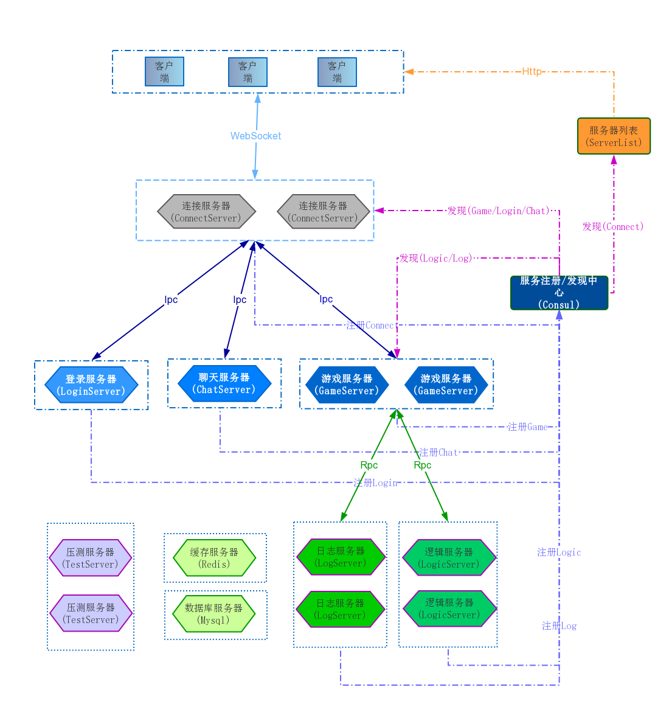

GoGameServer
===============

使用go搭建的一个游戏服务器项目  
1：consul作为服务注册/发现中心，便于服务的动态扩容  
2：与客户端的通信协议使用protobuf  
3：服务之间支持基于TCP的ipc，rpc通信  
4：缓存使用redis  
5：数据库支持mysql、mongodb

结构图
===============

启动说明
===============

	启动consul
	启动mysql(config/local/mysql.json)
	启动redis(config/local/redis.json)
	执行sh run.sh启动服务器
	执行sh stop.sh停止服务器
    执行sh test.sh启动测试服务器
	执行sh proto.sh生成proto文件